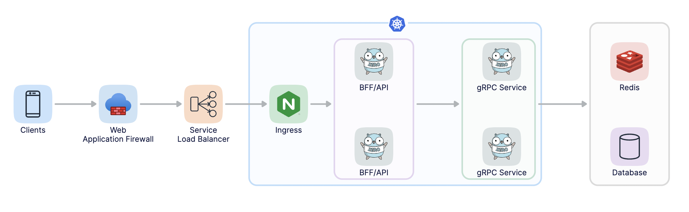

最近做开发基础架构设计，又经历了一次痛苦过程，记录一下。
同时感叹，这一次明显感受是没有以前的冲劲和精力了，真老了吧？
粗糙的记录一下，算是做个告别吧，最后一次干这事了！

## 关于基础架构图

## 关于Ingress的选择
比3年前更痛苦，因为阿里云多了很多东西，也改变了一些东西，如之前大概只有nginx ingress，现在还多了alb ingress和mse ingress。看文档官方是更推荐后2者，但尝试过后，太复杂了，没搞懂。听官方建议换回nginx ingress，一次性成功！

## 关于CLB是用4层负载还是7层负载的问题
我的通常理解，SSL证书部署在SLB里是比较合理且省事，因为证书支持泛域名，在部署多个应用的时候部署一次就够了。
但是在创建完nginx ingress后，自动创建CLB，而且配置的是4层协议，不是7层协议，SSL证书没办法部署。当然，应该是可以直接改成7层协议，用于部署SSL证书的，我没那么多，首先咨询了官方，得到回复：建议SSL证书配置在Ingress里，SLB使用4层监听，仅做透传。
有道理！虽然在部署多个应用的时候，有多个Ingress，同时对应了多次SSL证书的部署，稍有点麻烦，但还好仅仅只是一次性工作，接受官方的建议。

具体做法：在安装、配置Ingress的时候，勾选开启TLS，将域名填好，Cert和Key手动创建成Secret即可

## 关于服务类型的选择
学习k8s已经是3-4年前了，记忆模糊。简单复习了一遍还是没能记起来，测试ClusterIP和LoadBalancer都可以，字面理解，运维最小权限使用原则，选择了ClusterIP。

- ClusterIP：通过集群内部IP地址暴露服务，但该地址仅在集群内部可见、可达，它无法被集群外部的客户端访问;默认类型;建议由K8S动态指定一个;也支持用户手动明确指定。
- NodePort：NodePort是ClusterIP的增强类型，它会于ClusterIP的功能之外，在每个节点上使用一个相同的端口号将外部流量引入到该Service上来。
- LoadBalancer：是NodePort的增强类型，为各节点上的NodePort提供一个外部负载均衡器；需要公有云支持。

## 拉取镜像失败
创建Pod的时候遇到拉取镜像失败，按官方文档明显不对，咨询官方是因为少装了一个组件：aliyun-acr-credential-helper，模式默认auto。

装完后在acr-configuration配置项，修改
1. acr-registry-info删除：#
2. service-account配置：*
3. watch-namespace配置：all

把之前的pods删除重建即可。

## 关于启用SSL强制跳转
大部分时候，访问http能自动跳https，但强制使用http访问，还是不会跳转。尝试在ingress注解中配置强制跳转，输入辅助中找不到ssl-redirect项。
最终在配置项中kube-system命名空间里的nginx-configuration配置项中找到了，默认配置就是false，改过来就好了。

## 坑
选择ECS节点的时候，要特别关注一下支持的pod数量，有的20-25，多的能到45之多，差着1倍呢！默认的pod都能到接近20个左右，剩不了什么了。对于我们这种前期，甚至是很长时间占资源都很少，n多pod可以挤在一个节点上的节约情况就完全不适用了。
幸好在配置SLB的时候，把集群玩坏了，官方建议我退费重买。重新买的时候，选了满足硬件配置要求，同时支持的pod数是45的。这样2个节点刚好满足最小要求。

