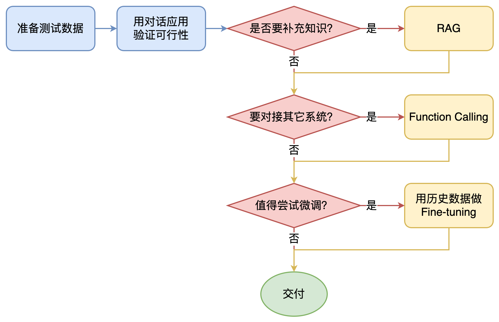

## 大模型应用开发基础

什么是AI：基于机器学习、神经网络的是AI，基于规则、搜索的不是AI。

通俗语言描述大模型工作原理：根据上文，猜测下一个词的概率。
训练和推理，是大模型工作的两个核心过程。
用人类比，训练就是学，推理就是用。

训练
1. 大模型阅读了人类曾说过的所有的话，这就是“机器学习”，这个过程叫“训练”。
2. 把一串token后面跟着的不同token的概率存入“神经网络”，保存的数据就是“参数”，也叫“权重”。

推理
1. 当我们给它若干token，大模型就能算出概率最高的下一个token是什么，这就是“生成”，也叫“推理”（不是人类大脑的逻辑推理）
2. 用生成的token，再加上上文，就能继续生成下一个token，以此类推生成更多文字

大模型在开始训练前，需要先训练一个tokenizer模型，它能把所有文本切成token

数字神经网络和人脑的生物神经网络，在数学原理上是一样的，所以，把AI当人看，来理解AI，控制AI，说服用户正确看待AI的不足。

### 大模型应用架构

#### Prompt

#### Agent + Function Calling

- Agent：AI主动提要求
- Function Calling：AI要求执行某个函数
- 场景举例：你问过年去哪儿玩，AI反问有多少预算

#### RAG：

- Embeddings：把文字转换为更易于相似度计算的编码，这种编码叫向量。
- 向量数据库：把向量存起来，方便查找。
- 向量搜索：根据输入向量，找到最相似的向量。
- 场景举例：考试时，看到一道题，到书上找相关内容，再结合题目组成答案，然后就都忘了（外挂知识库） 

#### Fine-tuning

努力学习考试内容，长期记住，活学活用。

Fine-tuning场景

1. 提高大模型的稳定性
2. 用户量大，降低推理成本的意义很大
3. 提高大模型的生成速度

