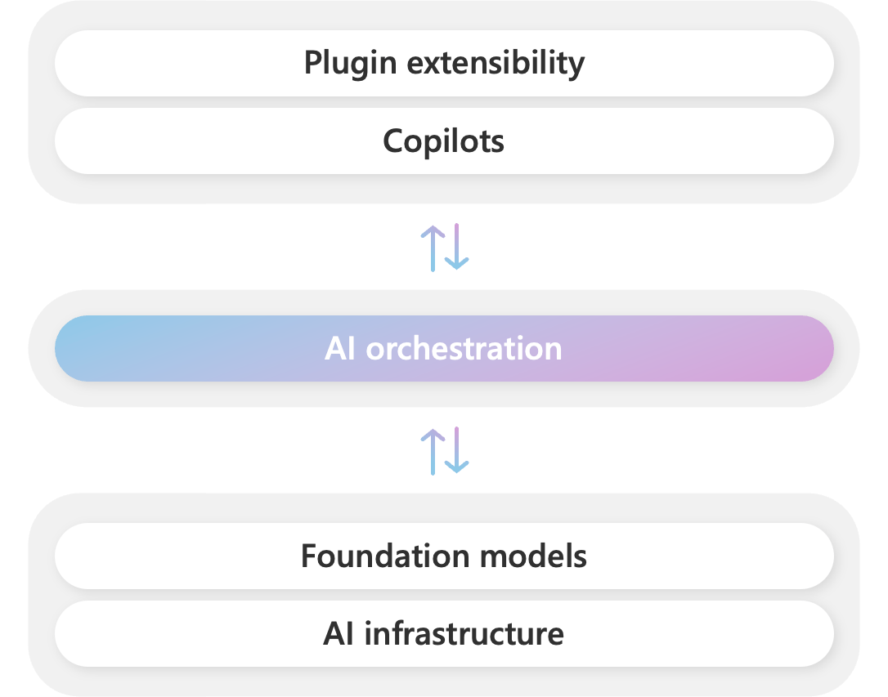

## 概念

### 大模型是什么

一个是巨大的参数文件，一个是包含运行这些参数的代码文件。前者是组成整个神经网络的权重，后者是用来运行这个神经网络的代码，可以是任何编程语言写的。

有了这俩文件，再来一台笔记本，我们就不需任何互联网连接和其他东西就可以与它（大模型）进行交流了，比如让它写首诗，它就开始为你生成文本。

### 有损压缩

参数从哪里来的？当然是通过模型训练。

本质上来说，**大模型训练就是对互联网数据进行有损压缩**，需要一个巨大的GPU集群来完成。

以700亿参数的llama 2为例，就需要6000块GPU，然后花上12天从大概10T的互联网数据中得到一个大约140GB的“压缩文件”，整个过程耗费大约200万美元。

### 工作原理

这个“压缩文件”，就是大模型对世界的理解，它就可以据此工作了。简言之，大模型的工作原理就是依靠包含压缩数据的神经网络对所给序列中的下一个单词进行预测。

### 幻觉

由于训练是一种有损压缩，而且问题也不总是在训练数据中，大模型给出的结果是不能保证100%准确的。

Andrej叫大模型推理为“做梦”，它有时可能只是简单模仿它学到的内容，然后给出一个大方向看起来对的东西。这其实就是幻觉。所以对于大模型的返回结果大家一定要谨慎对待，尤其是类似数学计算、逻辑分析以及关于事实的内容。

### 微调

在用大量互联网数据训练之后，还需要进行第二遍训练，也就是微调。微调强调质量大于数量，不再需要一开始用到的TB级单位数据，而是靠人工精心挑选和标记的对话来投喂。不过在此，Andrej认为，微调不能解决大模型的幻觉问题。

### 泛化

从有限的训练数据中学到的知识有效地应用到新的、未见过的数据上的能力

在理解泛化时，两个常见的概念是过拟合和欠拟合，它们都与模型的泛化能力紧密相关。

#### 过拟合（Overfitting）

当模型在训练数据上表现得非常好，甚至可以完全记住训练数据中的每个细节，但在新数据上表现很差时，就发生了过拟合。过拟合的模型过于复杂，以至于学习到了训练数据中的噪声和模式。这种情况下，模型的泛化能力非常差。

比喻：可以把过拟合比作一个学生考试时背诵了所有题目的答案，但当考试内容稍微变化时，学生却无法灵活应对。模型就像这个学生，只记住了训练数据的细节，而不是学习到数据背后的通用模式。

#### 欠拟合（Underfitting）

欠拟合是模型过于简单，无法很好地捕捉训练数据中的规律，导致在训练数据和新数据上都表现不佳。欠拟合的模型没能学习到足够多的特征，通常是因为模型太过简单，或者训练不充分。

比喻：欠拟合可以类比为一个学生只复习了一些基础知识，但没有足够深入地理解课程内容，结果不仅在模拟考试中表现差，在实际考试中也是如此。

#### 提升泛化能力的方法

- 增加数据量：更多的数据可以帮助模型学习到更广泛的特征，提高泛化能力。
- 正则化：通过正则化手段限制模型的复杂度，防止过拟合。
- 数据增强：在图像和NLP任务中，可以通过生成更多的变化数据（如旋转图片、同义词替换等）来增加模型的鲁棒性。
- 早停（Early stopping）：在训练过程中，监控模型在验证集上的表现，如果验证集误差开始上升，就提前停止训练，避免过度拟合训练数据。

## 大模型应用开发基础

什么是AI：基于机器学习、神经网络的是AI，基于规则、搜索的不是AI。

通俗语言描述大模型工作原理：根据上文，猜测下一个词的概率。
训练和推理，是大模型工作的两个核心过程。
用人类比，训练就是学，推理就是用。

训练
1. 大模型阅读了人类曾说过的所有的话，这就是“机器学习”，这个过程叫“训练”。
2. 把一串token后面跟着的不同token的概率存入“神经网络”，保存的数据就是“参数”，也叫“权重”。

推理
1. 当我们给它若干token，大模型就能算出概率最高的下一个token是什么，这就是“生成”，也叫“推理”（不是人类大脑的逻辑推理）
2. 用生成的token，再加上上文，就能继续生成下一个token，以此类推生成更多文字

大模型在开始训练前，需要先训练一个tokenizer模型，它能把所有文本切成token

数字神经网络和人脑的生物神经网络，在数学原理上是一样的，所以，把AI当人看，来理解AI，控制AI，说服用户正确看待AI的不足。

### 大模型应用架构

#### Prompt

#### Agent + Function Calling

- Agent：AI主动提要求
- Function Calling：AI要求执行某个函数
- 场景举例：你问过年去哪儿玩，AI反问有多少预算

#### RAG：

- Embeddings：把文字转换为更易于相似度计算的编码，这种编码叫向量。
- 向量数据库：把向量存起来，方便查找。
- 向量搜索：根据输入向量，找到最相似的向量。
- 场景举例：考试时，看到一道题，到书上找相关内容，再结合题目组成答案，然后就都忘了（外挂知识库） 

#### Fine-tuning

努力学习考试内容，长期记住，活学活用。

Fine-tuning场景

1. 提高大模型的稳定性
2. 用户量大，降低推理成本的意义很大
3. 提高大模型的生成速度

## Prompt Engineering

高质量Prompt核心要点：`具体、丰富、少歧义`

### Prompt典型构成

- **角色：**给AI定义一个最匹配任务的角色，比如：你是一位软件工程师、你是一位小学老师。马问题收窄，减小二义性。将重要信息放在开头或结尾。
- **指示：**对任务进行描述
- **上下文：**给出与任务相关的其它背景信息（尤其在多轮交互中）
- **例子：**必要时给出举例，对输出正确性有很大帮助
- **输入：**任务的输入信息；在提示词中明确的标识出输入
- **输出：**输出的格式描述，以便后续模块自动解析模型的输出结果，比如JSON、XML

LLM本身是无状态的。

## Function Calling

### 为什么要大模型连接外部世界

大模型两大缺陷：

1. 并非知晓一切
   1. 训练数据不可能什么都有。垂直、非公开数据必有欠缺
   2. 不知道最新信息，大模型的训练周期很长，且更新一次耗资巨大，还有越训越傻的风险。所以ta不可能实时训练。GPT-3.5的知识截止至2021年9年，GPT-4是2023年12月。
2. 没有【真逻辑】。它表现出的逻辑、推理，是训练文本的统计规律，而不是真正的逻辑，所以有幻觉。

所以，大模型需要连接真实世界，并对接真逻辑系统。

### 运行机制

## RAG & Embeddings

### LLM固有的局限性

1. LLM的知识不是实时的
2. LLM可能不知道你私有的领域/业务知识

### RAG：通过检索的方法来增强生成模型的能力。

搭建过程：

1. 文档加载，按一定条件切割成片段
2. 将切割的文本片段写入检索引擎
3. 封闭检索接口
4. 构建调用流程：查询 -> 检索 -> Prompt -> LLM -> 回复。

即：文档加载入ES，根据关键字检索ES，找到相关的文本，将问题和相关的文本填充Prompt，调用LLM。

关键字检索的局限性：同一个语义，用词不同，可能导致检索不到有效的结果。

### 向量检索

解决关键字检索的局限性

#### 文本向量（Text Embeddings）

语义模糊的匹配，不是字面模糊匹配。

1. 将文本转成一组浮点数：每个下标i，对应一个维度
2. 整个数组对应一个n维空间的一个点，即文本向量Enbeddings
3. 向量之间可以计算距离，距离远近对应语义相似度大小

### 向量数据库

为向量检索设计的中间件

向量由Enbedding模型产生

### 向量模型本地部署

## Assistants API

面向开发者生态的工具，降低开发门槛，生成自己的ChatGPT

## Semantic Kernel（SK）

1. 微软研发的，面向大模型的开源开发框架
2. 支持用不同开发语言基于OpenAI、Azure OpenAI API、Huggingface（大多数）开发大模型应用
3. 封闭一系列开箱即用的工具

### 技术栈：Copilot Stack

1. Plugin extensibility：插件扩展
2. Copilots：AI助手
3. AI orchestration：AI编排，即SK
4. Foundation models：基础大模型，例如GPT-4
5. AI infrastucture：AI基础设施，例如PyTorch、GPU

### AI编排：

1. 让开发者更容易把LLM的能力集成到应用中，像调用函数一样简单
2. 让Prompt构成的“函数”与原生函数之间可以很方便的互相嵌套调用
3. 让开发者开发的LLM能力与应用解耦，高度可复用
4. 让开发者能与微软的整个Copilot生态紧密结合

### SK架构

1. Models and Memory：类比大脑，Memory持久化产品，相当于CPU和内存
2. Connectors：用来连接各种外部服务，类似驱动程序
3. Plugins：用来连接内部技能
4. Triggers and actions：外部系统的触发器和动作，类比为四肢
5. Semantic Kernel：相当于操作系统，做核心资源调配

### 总结

1. 如果需要切换不同LLM或有大量Prompt调试需求，选择一个一个开发框架会更容易
2. C#/Java技术栈，SK是唯一选择
3. Python技术栈，考虑LangChain

## Lang Chain

面向大模型做应用开发的SDK，方便程序员使用大模型能力开发软件的开发包/工具集，减少底层复杂和重复性工作量。

- 统一封装了各种模型的调用接口，包括补全型和对话型
- 提供了PromptTemplate类，可以自定义带变量的模板
- 提供一些列输出解析器，用于将大模型的输出解析成结构化对象；额外带有自动修复功能

## Dify

Dify 是一个开源的大语言模型（LLM）应用开发平台，融合了后端即服务（Backend as a Service,BaaS）和 LLMOps 的理念，旨在帮助开发者快速构建和部署生成式 AI 应用。

### 核心功能

- 低代码/无代码开发

​	Dify 提供了可视化的界面，允许开发者通过拖拽、配置等方式定义 Prompt（提示词）、上下文和插件，无需深入底层技术细节，降低了开发门槛。

- 模块化设计

​	采用模块化架构，每个模块都有清晰的功能和接口，开发者可以根据需求选择性地使用这些模块来构建自己的 AI 应用。

- 丰富的功能组件

- AI 工作流：通过可视化画布构建和测试强大的 AI 工作流。

- RAG 管道：支持从文档摄入到检索的完整流程，可从 PDF、PPT 等常见格式中提取文本。

- Agent 智能体：基于 LLM 的推理能力，可以自主规划任务、调用工具，完成复杂任务。

- 模型管理：支持数百种专有和开源的 LLM，如 [GPT](https://zhida.zhihu.com/search?content_id=253012872&content_type=Article&match_order=1&q=GPT&zhida_source=entity)、[Llama2](https://zhida.zhihu.com/search?content_id=253012872&content_type=Article&match_order=1&q=Llama2&zhida_source=entity) 等，并提供模型性能比较功能。

- 工具集成

​	Dify 提供了 50 多种内置工具（如谷歌搜索、[DALL·E](https://zhida.zhihu.com/search?content_id=253012872&content_type=Article&match_order=1&q=DALL·E&zhida_source=entity)、[Stable Diffusion](https://zhida.zhihu.com/search?content_id=253012872&content_type=Article&match_order=1&q=Stable+Diffusion&zhida_source=entity)、[WolframAlpha](https://zhida.zhihu.com/search?content_id=253012872&content_type=Article&match_order=1&q=WolframAlpha&zhida_source=entity) 等），并支持自定义工具的导入，扩展了 LLM 的能力。

- 数据集管理

​	提供强大的数据集管理功能，支持数据的导入、标注、版本控制等，帮助开发者更好地管理 AI 应用的数据。

- 后端即服务（BaaS）

​	所有功能都提供相应的 API，方便开发者将 Dify 集成到自己的业务逻辑中。

## fine-tuning

在预训练模型的基础上进行的进一步训练，预训练模型是在大量数据上训练得到的，它已经学习到了语言的基本规律和丰富的特征表示，但这些模型可能并不能直接适用于特定的任务或领域，因为缺乏对特定领域知识的理解和适应性。

模型微调通过在特定任务的数据集上继续训练预训练模型来进行，使用模型能够学习到与任务相关的特定特征和知识。这个过程通常涉及到模型权重的微幅调整，而不是从头开始训练一个全新的模型。

### 基本概念

#### 数据集

用于模型微调的数据，包含了特定领域的知识和任务要求。这些数据需要经过标和整理，以便模型能够学习。

#### LoRA（Low-Rank Adaptation）

常用的微调算法，通过定制的方式对大语言模型进行微调的工具（非全量更新模型参数）

#### 标注

把原始数据变成机器能处理的结构化数据

基础模型 + 微调

基础模型 + 轻量级微调（高效）

Tensor type：

#### SFT（有监督微调，Supervised Fine-Tuning）

通过提供人工标注的数据，进一步训练预训练模型，让模型能够更加精准的处理特定领域的任务

除了有监督微调，还有无监督微调，广义上的微调通常是指有监督微调

#### RLHF（强化学习,Reinforcement Learning from Human Feedback）

##### DPO（Direct Preference Optimization）

通过**人类对比选择**（例如A选项和B选项，哪个更好）直接优化生成模型，使其产生更符合用户需求的结果；调整幅度大

##### PPO（Proxinmal Policy Optimization）

通过**奖励信号**（如点赞、点踩）来**渐进式调整模型的行为策略；调整幅度小

### 过程

1. 数据准备：收集和准备特定任务的数据集
2. 模型选择：选择一个预训练模型作为基础模型
3. 迁移学习：在新数据集上继续训练模型，同时保留预训练模型的知识
4. 参数调整：根据需要调整模型的参数，如学习率、批大小等
5. 模型评估：在验证集上评估模型的性能，并根据反馈进行调整

### 优势

#### 资源效率

相比于从头开始训练模型，微调可以显著减少所需的数据量和计算资源

#### 快速部署

微调可以适应新任务，加速模型的部署过程

#### 性能提升

针对特定任务的微调可以提高模型的准确性和鲁棒性

#### 领域适应性

微调可以帮助模型更好的理解和适应特定领域的语言特点

## 模型量化

LLM对显存的占用大，在高并发的环境下/资源并不丰富的情况下，可能会导致服务崩溃，解决这个问题最常用的手段就是对LLM进行低精度的量化，从而节省显存和带宽。

- **更少的存储开销和带宽需求**。即使用更少的bit存储数据，有效减少应用对存储资源的依赖；
- **更快的计算速度**。即对大多数处理器而言，[整型运算](https://zhida.zhihu.com/search?content_id=237356308&content_type=Article&match_order=1&q=整型运算&zhida_source=entity)的速度一般（但不总是）要比[浮点运算](https://zhida.zhihu.com/search?content_id=237356308&content_type=Article&match_order=1&q=浮点运算&zhida_source=entity)更快一些；
- **更低的能耗、更低的芯片占用面积**

模型量化就是将浮点存储/运算转换为整型存储/运算的一种[模型压缩](https://link.zhihu.com/?target=https%3A//so.csdn.net/so/search%3Fq%3D%E6%A8%A1%E5%9E%8B%E5%8E%8B%E7%BC%A9%26spm%3D1001.2101.3001.7020)技术。**简单直白点讲，即原来表示一个权重需要使用float32/float16表示，量化后只需要使用int8来表示就可以啦，仅仅这一个操作，我们就可以获得接近4倍的网络加速。**

## 未来趋势

1. 多模态：图片、音频、视频
2. 深度思考：缓慢进行的理性思考，现在都是快速产生的直觉
3. 自优化
   1. 客户化LLM：大模型正**朝着定制化的方向发展**，允许用户将它们定制，用于以特定“身份”完成特定的任务。
4. LLM OS：
5. 类比传统的操作系统，在“大模型系统”中，LLM作为核心，就像CPU一样，其中包括了管理其他“软硬件”工具的接口。而内存、硬盘等模块，则分别对应大模型的窗口、嵌入。代码解释器、多模态、浏览器则是运行在这个系统上的应用程序，由大模型进行统筹调用，从而解决用户提出的需求。
